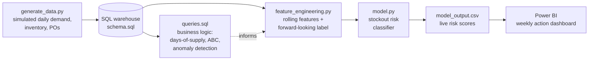

[_mockup_table.html](https://github.com/user-attachments/files/29383316/_mockup_table.html)
[_mockup_overview.html](https://github.com/user-attachments/files/29383315/_mockup_overview.html)
# Supply Chain & Stockout Risk Intelligence Platform

**An end-to-end analytics pipeline — SQL → Python/ML → Power BI — built on a simulated multi-warehouse retail supply chain (40 SKUs, 4 warehouses, 10 suppliers, 1 year of daily data).**

This isn't a single notebook or a single dashboard. It's a pipeline where each stage produces a real artifact that the next stage consumes — the same shape as a production analytics system, scaled down to something one person can build and explain end-to-end.

> **Why this domain:** supply chain/inventory naturally needs *both* a predictive model (will this SKU stock out?) and a dashboard that drives a weekly decision (which SKUs need a PO?) — it's not a dashboard bolted onto a model for show, the model's output **is** the dashboard's main table.

> **On the data:** synthetically generated (`python/generate_data.py`, seeded for reproducibility) via a day-by-day inventory simulation — demand, seasonality, reorder logic, lead times, and a real supplier disruption event are all simulated mechanically, not faked after the fact. Every number below comes from actually running the pipeline.

---

## Architecture



## Tech stack
Python (pandas, scikit-learn, joblib) for simulation, features, and modeling · SQL (ANSI-standard CTEs/window functions, SQLite/Postgres-compatible) for the business-logic layer · Power BI for the decision-facing dashboard (build guide + DAX included, since a `.pbix` can't be generated outside Power BI itself).

## How to run it
```bash
pip install -r python/requirements.txt

python python/generate_data.py            # simulates 1 year of supply chain data
sqlite3 sql/supply_chain.db < sql/schema.sql
# (load data/raw/*.csv into the db, or use the snippet in load notes below)
sqlite3 sql/supply_chain.db < sql/queries.sql

python python/feature_engineering.py       # builds ML-ready features + labels
python python/model.py                     # trains model, scores latest snapshot
# -> powerbi/model_output.csv is what you import into Power BI
```
Then follow `powerbi/build_guide.md` to build the dashboard (~25-30 min).

---

## Key findings

**1. The model surfaces a real, time-bound disruption — not noise.**
Three suppliers were simulated with a lead-time blowout (3x normal) during Jul-Sep. The `queries.sql` anomaly query catches it precisely: those three suppliers' average lead time jumps to **1.9x–3.1x their baseline**, exactly during that window and no other. During the disruption, affected SKUs stocked out **34.8%** of days vs. **1.2%** for everyone else. *(SQL query 3)*
→ *So what:* this is the kind of check that should run automatically every month against live PO data — not get discovered in a quarterly business review, three months after the damage is done.

**2. The classifier has real, usable predictive power — not an inflated demo number.**
Logistic regression (selected over random forest on ROC-AUC): **ROC-AUC 0.84**, **recall 0.76**, **precision 0.60** at the chosen threshold. *(`python/model.py`)*
→ *So what:* the threshold was deliberately chosen to prioritize recall — missing a real stockout costs more than reviewing a SKU that turns out fine — and that trade-off is stated explicitly, not buried in a single accuracy number.

**3. The single strongest predictor is the simplest one: `days_of_supply`.**
It dominates the model's coefficients, ahead of demand volatility, lead time, and supplier reliability. *(`data/processed/feature_importance.csv`)*
→ *So what:* this is a feature you can compute with one SQL query, no ML required — a useful reminder that the ML layer here adds value by *combining* signals (volatility + reliability + lead time) into one score, not by finding something invisible to SQL alone.

**4. Scoring the latest snapshot tells a coherent, explainable story.**
At the most recent date (Dec 31), Electronics and Toys — the two highest holiday-demand categories — show the thinnest stock cushion (4–5 days of supply on average), while Garden (off-season in winter) shows 83 days of excess supply. **92 of 160** SKU-warehouse pairs are flagged High risk, with an estimated **$2.14M** in exposed demand if those SKUs aren't reordered in time. *(`powerbi/model_output.csv`)*
→ *So what:* a 57% high-risk rate looks alarming in isolation, but it's explainable and seasonal — exactly the kind of distinction a dashboard needs to surface (rate isn't risk without context), and exactly why reorder *policy*, not just reorder *execution*, should be revisited seasonally rather than held constant year-round.

---

## Why this beats a typical entry-level portfolio project
Most portfolio projects stop at "I made a dashboard from a Kaggle CSV" or "I trained a model and got 85% accuracy." This project deliberately closes both gaps: the SQL layer does real business-logic work (not just `SELECT * GROUP BY`), the ML layer is tied to one specific decision with an explicitly justified metric trade-off (not an accuracy score with no business translation), and the dashboard's main visual is the model's actual output table, not a set of charts disconnected from what was modeled. Each stage hands the next stage a real file — `queries.sql` → `feature_engineering.py` → `model.py` → `model_output.csv` → Power BI — so the whole thing can be re-run end-to-end, which is the difference between "a portfolio piece" and "a pipeline."

---

## Repo structure
```
.
├── README.md
├── sql/
│   ├── schema.sql
│   └── queries.sql                    # 8 business-logic queries
├── python/
│   ├── generate_data.py               # synthetic simulation (seeded)
│   ├── feature_engineering.py         # rolling features + forward label
│   ├── model.py                       # training, evaluation, live scoring
│   └── requirements.txt
├── data/
│   ├── raw/                           # products, suppliers, warehouses,
│   │                                    daily_sales, inventory_snapshots, POs
│   └── processed/                     # model_features.csv, model_output.csv,
│                                         feature_importance.csv, metrics.json
└── powerbi/
    ├── model_output.csv               # what to import into Power BI
    ├── dax_measures.md                # every DAX formula, ready to paste
    └── build_guide.md                 # step-by-step dashboard build (~25 min)
```

## Honest limitations (worth saying out loud in an interview)
- Data is synthetic — the patterns are real and internally consistent, but it's not a live production system with the messiness real data has (missing values, schema drift, duplicate records).
- The model is intentionally simple (logistic regression / random forest on engineered features) — the natural next step toward the AI/data-engineer direction is wrapping this in an orchestrated pipeline (Airflow/Prefect) that re-runs weekly and retrains on a rolling window, plus comparing against a time-series-specific model (e.g. Prophet) for the demand side specifically.
